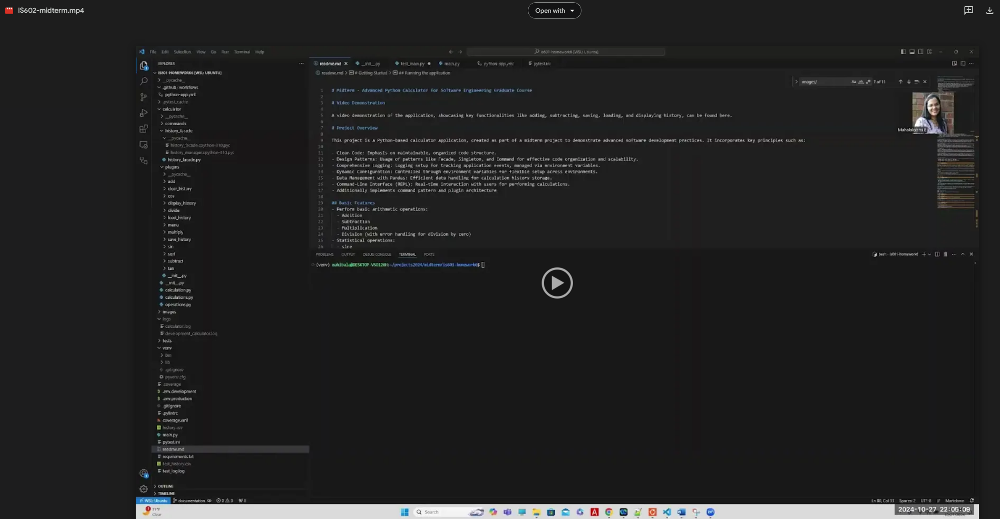
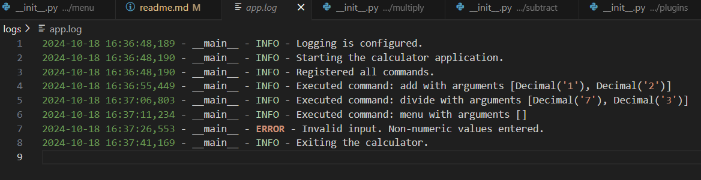
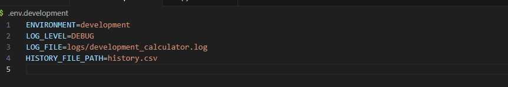
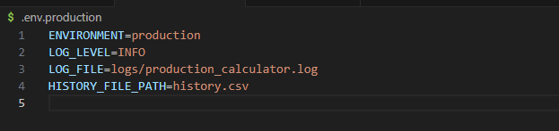
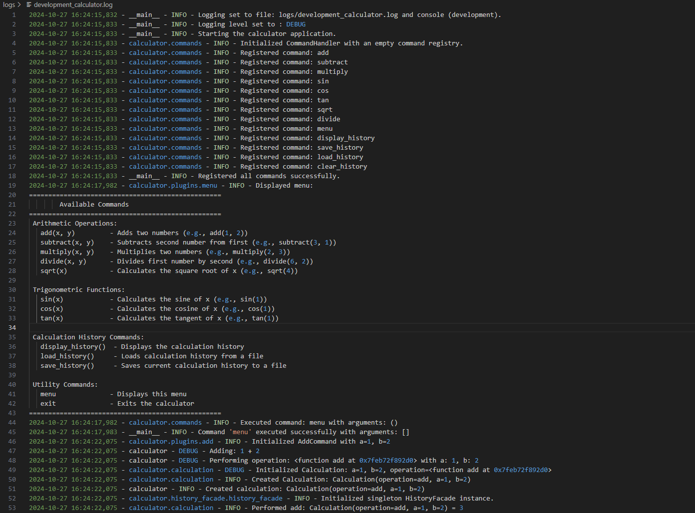
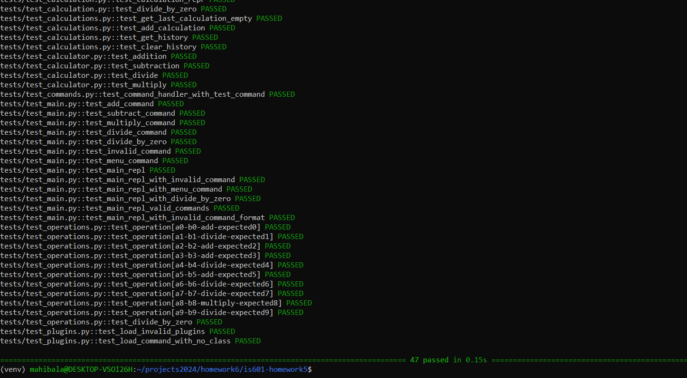
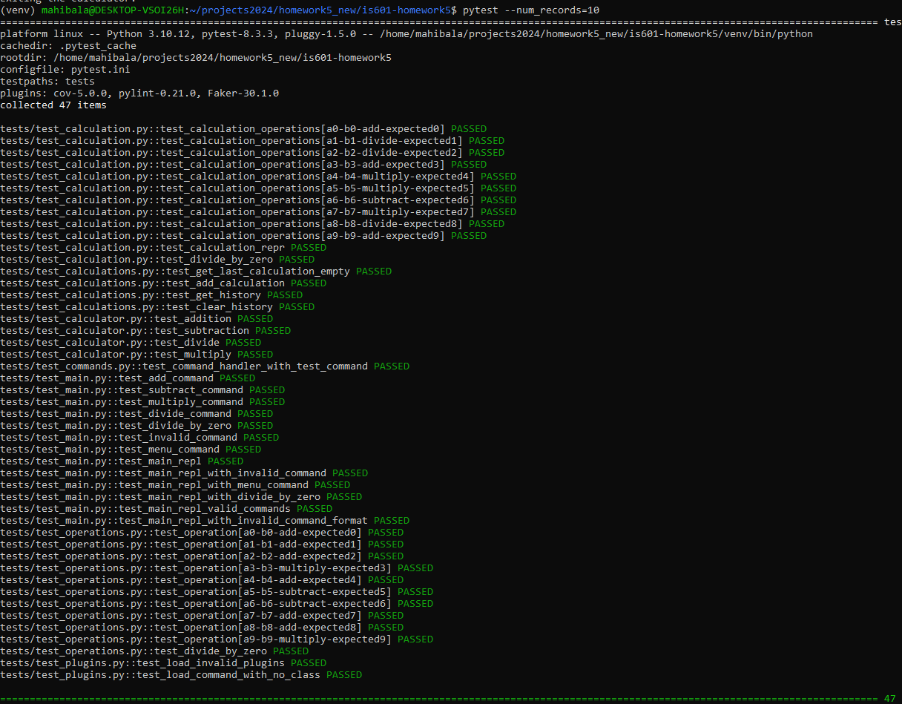
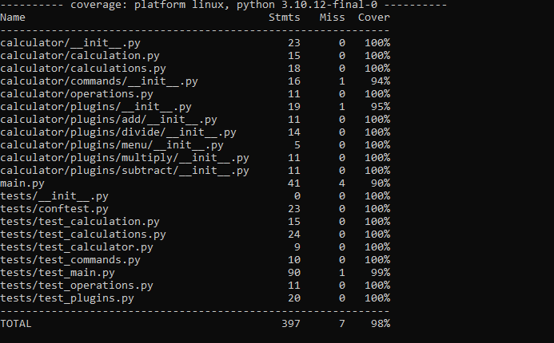
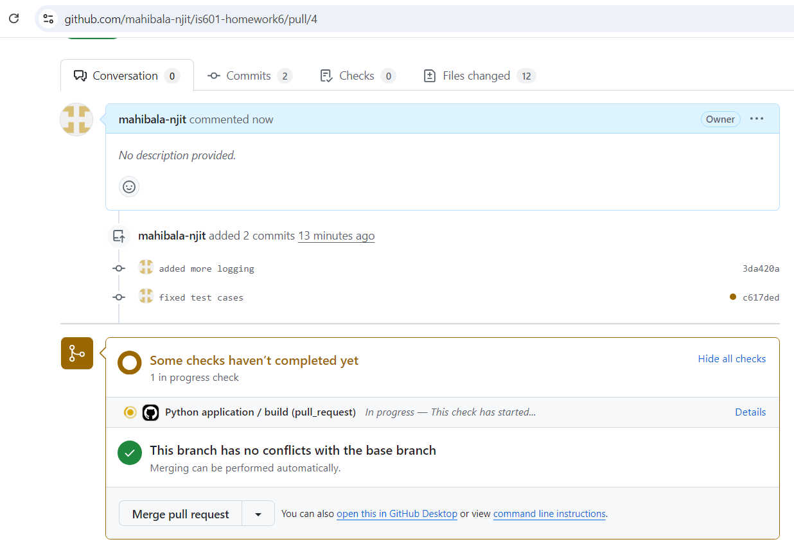
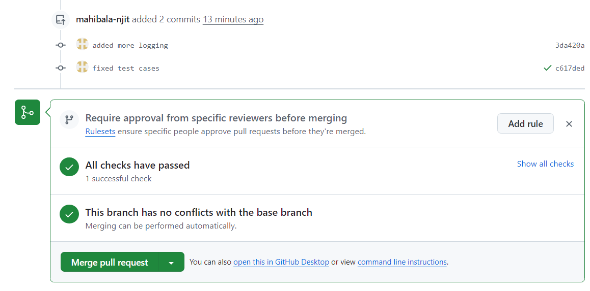

# Midterm - Advanced Python Calculator for Software Engineering Graduate Course

# Project Overview

This project is a Python-based calculator application, created as part of a midterm project to demonstrate advanced software development practices. It incorporates key principles such as:

- Clean Code: Emphasis on maintainable, organized code structure.
- Design Patterns: Usage of patterns like Facade, Singleton, and Command for effective code organization and scalability.
- Comprehensive Logging: Logging setup for tracking application events, managed via environment variables.
- Dynamic Configuration: Controlled through environment variables for flexible setup across environments.
- Data Management with Pandas: Efficient data handling for calculation history storage.
- Command-Line Interface (REPL): Real-time interaction with users for performing calculations.
- Additionally implements command pattern and plugin architecture

## Basic Features
- Perform basic arithmetic operations:
  - Addition
  - Subtraction
  - Multiplication
  - Division (with error handling for division by zero)
- Statistical operations:
  - sine
  - cosine
  - tangent
  - square root 
- Display a history of calculatios
- Store a history of calculations
- Load the calculationhistory
- Clear the calculation history
- Uses `Decimal` for high-precision arithmetic

## Addtional Features

- Implemented history management using pandas library
- Implemented Command Pattern along with Menu command
- Implemented Plugin architecture to dynamically load the commands
- Implemented logging and have used environment variables
- Github actions configured (Continuous integration)

# Video Demonstration

A video demonstration of the application, showcasing key functionalities like adding, subtracting, saving, loading, and displaying history, can be found here.

# Getting Started

## Prerequisites

- Python 3.10+
- Pandas library
- pytest for testing
- dotenv for environment variable management

## Installation

1. Clone the repository
```bash
git clone git@github.com:mahibala-njit/is601-midterm.git
cd <repository-directory>
```

2. Install the requirements
```bash
pip3 install -r requirements.txt
```

## Running the application

## Logs show up in the console as well as in app.log locally

```bash
python main.py
```

1. Console output


2. app.log



# Project Structure

- calculator/: Core application code, organized by functionality and design pattern.
    - commands/: Command pattern for calculator operations (addition, subtraction, etc.).
    - plugins/: Plugins for dynamically loading the commands and other functionalities (e.g., loading, saving history).
    - history_facade.py: Implements the Facade and Singleton pattern to manage calculation history.
- tests/: Unit tests for all components, ensuring full coverage.

# Design Patterns

1. Command Pattern
Purpose: The Command pattern encapsulates each calculator operation (like addition, subtraction, loading history) as an individual object, allowing flexible command execution.
Implementation: Each calculator operation (e.g., AddCommand, SubtractCommand, LoadHistoryCommand) inherits from the Command abstract base class in command_handler.py. Each command has an execute method, ensuring consistent execution across commands. This approach helps simplify REPL handling and enables seamless addition of new commands without modifying core functionality.


2. Plugin Pattern
Purpose: The Plugin pattern enables a modular and extensible architecture where each command can be dynamically loaded. This is particularly beneficial for managing calculator functions that might be expanded later (e.g., adding trigonometric functions).
Implementation: In the commands folder, each operation (add, subtract, multiply, etc.) is implemented in a separate subfolder with a __init__.py file containing the command logic. This structure allows each command to be dynamically loaded into the REPL by the main application, without requiring changes to existing code.


3. Facade Pattern
Purpose: The Facade pattern simplifies interactions with complex history management functions by providing a single interface. In this project, it abstracts operations for loading, saving, displaying, and clearing history, making the codebase more maintainable and user-friendly.
Implementation: The HistoryFacade class provides methods like load_history, save_history, display_history, and clear_history that interact with the underlying Pandas data structure without exposing its complexities to the rest of the application. This pattern is particularly useful in handling multiple history-related functionalities with a simplified interface.


4. Singleton Pattern
Purpose: The Singleton pattern ensures that only one instance of HistoryFacade exists, controlling access to history data and avoiding redundancy in history management.
Implementation: In HistoryFacade, the Singleton pattern is implemented by defining a class-level instance and overriding the constructor to check if an instance already exists. If not, it creates one; otherwise, it returns the existing instance. This approach maintains a single history management instance, promoting resource efficiency.


# Environment Variables

Environment variables are utilized for dynamic configuration, allowing for flexible log settings and file paths. Configurations are managed through .env files:
- LOG_LEVEL: Sets the level of logging (e.g., DEBUG, INFO).
- LOG_FILE: Specifies the file name and location for storing logs.
- FILE_PATH: Location for storing calculation history data.





Organized in such a way that that when it runs locally the environment variable would be set to 'development'. Based on the branch it gets merged to, the github actions has a step which assigns the 'ENVIRONMENT'. If it gets merged to main branch, the ENVIRONMENT would be set to 'production' and automatically the corresponding .env would be loaded during application runtime. See below YAML file.


# Logging

Logging is critical for tracking application events and errors. The setup in main.py configures logging levels and output destinations based on environment variables. Each command and action is logged, allowing for easy debugging and monitoring.

- Logging settings are dynamically controlled via .env variables.
- Logs track successful command executions and potential errors.

[Link to setup logging in main.py](https://github.com/mahibala-njit/is601-midterm/blob/296e7d956f0139751fcbd1490a54932e913c5195/main.py#L23)

Sample log output:



# Exception Handling

This project employs both Look Before You Leap (LBYL) and Easier to Ask for Forgiveness than Permission (EAFP) approaches to error handling:
- LBYL: Used to validate file paths and prevent runtime errors when possible.
- EAFP: Used where direct action is more efficient, handling exceptions as they arise.

Examples:
- LBYL: HistoryFacade checks if the history file exists before loading data. [LBYL Reference](https://github.com/mahibala-njit/is601-midterm/blob/296e7d956f0139751fcbd1490a54932e913c5195/calculator/history_facade/history_facade.py#L58)
- EAFP: Direct file access in save/load commands with try/except blocks for error handling. [EAFP Reference](https://github.com/mahibala-njit/is601-midterm/blob/296e7d956f0139751fcbd1490a54932e913c5195/calculator/history_facade/history_facade.py#L62)

# Tests and CI/CD 
This project includes extensive unit tests for each feature and operation. Testing is done using the pytest framework, and code linting is handled by pylint to ensure code quality.
GitHub Actions is configured to run all tests upon each push or pull request, ensuring code reliability.

The project has been fully tested using pytest and pylint

```bash
pytest --num_records=100
pytest --pylint --cov
pytest --pylint --cov --cov-report=xml --cov-report=term-missing
```
## Testing results:
1. pytest --num_records=10


2. pytest --pylint --cov


3. pytest --pylint --cov --cov-report=xml --cov-report=term-missing


## Github actions Test

1. On pull request to main branch, github actions got triggered and is in progress



2. Github actions complete



3. View Github actions workflow and results


