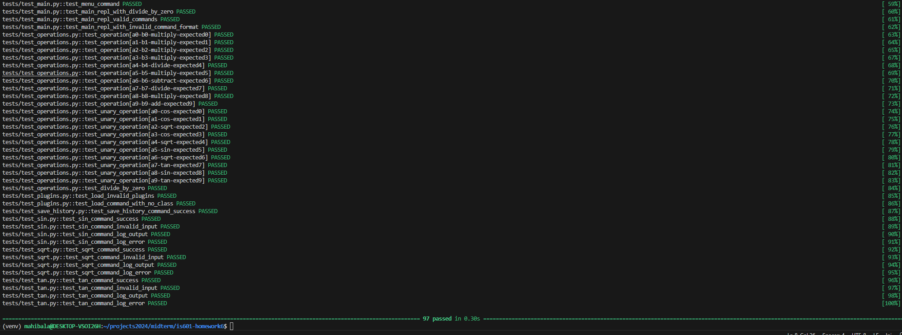

# Midterm - Advanced Python Calculator for Software Engineering Graduate Course

# Project Overview

This project is a Python-based calculator application, created as part of a midterm project to demonstrate advanced software development practices. It incorporates key principles such as:

- Clean Code: Emphasis on maintainable, organized code structure.
- Design Patterns: Usage of patterns like Facade, Singleton, and Command for effective code organization and scalability.
- Comprehensive Logging: Logging setup for tracking application events, managed via environment variables.
- Dynamic Configuration: Controlled through environment variables for flexible setup across environments.
- Data Management with Pandas: Efficient data handling for calculation history storage.
- Command-Line Interface (REPL): Real-time interaction with users for performing calculations.
- Additionally implements command pattern and plugin architecture

## Basic Features
- Perform basic arithmetic operations:
  - Addition
  - Subtraction
  - Multiplication
  - Division (with error handling for division by zero)
- Statistical operations:
  - sine
  - cosine
  - tangent
  - square root 
- Display a history of calculatios
- Store a history of calculations
- Load the calculationhistory
- Clear the calculation history
- Uses `Decimal` for high-precision arithmetic

## Addtional Features

- Implemented history management using pandas library
- Implemented Command Pattern along with Menu command
- Implemented Plugin architecture to dynamically load the commands
- Implemented logging and have used environment variables
- Github actions configured (Continuous integration)

# Video Demonstration

A video demonstration of the application, showcasing key functionalities like adding, subtracting, saving, loading, and displaying history, can be found here.

# Getting Started

## Prerequisites

- Python 3.10+
- Pandas library
- pytest for testing
- dotenv for environment variable management

## Installation

1. Clone the repository
```bash
git clone git@github.com:mahibala-njit/is601-midterm.git
cd <repository-directory>
```

2. Install the requirements
```bash
pip3 install -r requirements.txt
```

## Running the application

## Logs show up in the console as well as in app.log locally

```bash
python main.py
```

1. Console output


2. app.log


# Project Structure

- calculator/: Core application code, organized by functionality and design pattern.
    - commands/: Command pattern for calculator operations (addition, subtraction, etc.).
    - plugins/: Plugins for dynamically loading the commands and other functionalities (e.g., loading, saving history).
    - history_facade.py: Implements the Facade and Singleton pattern to manage calculation history.
- tests/: Unit tests for all components, ensuring full coverage.

# Design Patterns

# Environment Variables

Environment variables are utilized for dynamic configuration, allowing for flexible log settings and file paths. Configurations are managed through .env files:
- LOG_LEVEL: Sets the level of logging (e.g., DEBUG, INFO).
- LOG_FILE: Specifies the file name and location for storing logs.
- FILE_PATH: Location for storing calculation history data.

# Logging

Logging is critical for tracking application events and errors. The setup in main.py configures logging levels and output destinations based on environment variables. Each command and action is logged, allowing for easy debugging and monitoring.

- Logging settings are dynamically controlled via .env variables.
- Logs track successful command executions and potential errors.

# Exception Handling

This project employs both Look Before You Leap (LBYL) and Easier to Ask for Forgiveness than Permission (EAFP) approaches to error handling:
- LBYL: Used to validate file paths and prevent runtime errors when possible.
- EAFP: Used where direct action is more efficient, handling exceptions as they arise.

Examples:
- LBYL: HistoryFacade checks if the history file exists before loading data.
- EAFP: Direct file access in save/load commands with try/except blocks for error handling.

# Tests and CI/CD 
This project includes extensive unit tests for each feature and operation. Testing is done using the pytest framework, and code linting is handled by pylint to ensure code quality.
GitHub Actions is configured to run all tests upon each push or pull request, ensuring code reliability.

The project has been fully tested using pytest and pylint

```bash
pytest --num_records=100
pytest --pylint --cov
pytest --pylint --cov --cov-report=xml --cov-report=term-missing
```
## Testing results:
1. pytest --num_records=10


2. pytest --pylint --cov


3. pytest --pylint --cov --cov-report=xml --cov-report=term-missing


## Github actions Test

1. On pull request to main branch, github actions got triggered and is in progress


2. Github actions complete


3. View Github actions workflow and results


